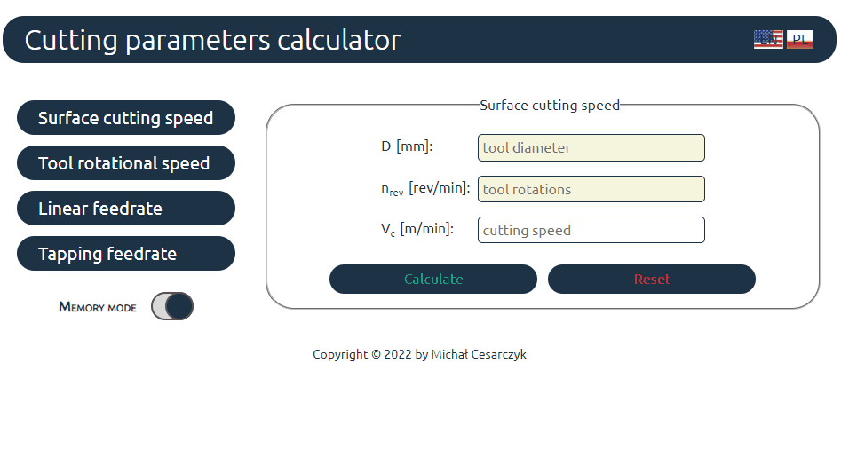
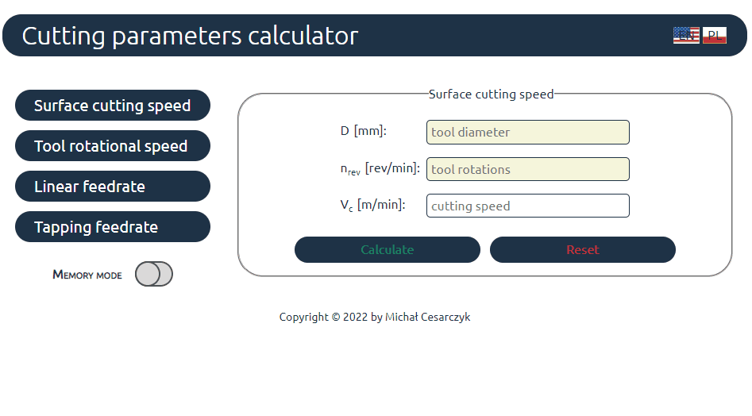

# CNC-parameters-calc

## Simple calculator of cutting parameters for CNC and traditional machininsts.

### Demo:

[https://mcesarczyk.github.io/cnc-calc-react/](https://mcesarczyk.github.io/cnc-calc-react/)

### Brief description:

Since my first profession is **CNC Programming** I use this formulas in my day to day work.
I plan to add next functionalities with time.
So, don't hesitate to contact me on: michal.cesarczyk@gmail.com to propose another one.

### Features:

1. Calculation forms:

   - Drilling/milling:

     - linear cutting speed in function of diameter and spindle speed
     - tool rotational speed in function of diameter and surface speed
     - feed rate in function of spindle speed and:
       - feed per revolution
       - feed per tooth, numer of tooth

   - Threading/tapping:
     - feed rate for tapping in function of spindle speed and threading tool pitch  
       (pitch value is selected from list according to tool diameter)

2. Language switching between english and polish.

3. Memory mode to transfer values beetween forms.

- below is default forms behaviour:

- and with memory mode active:

And this is how it works:

### Used technologies

1. html
1. CSS
1. BEM
1. JavaScript/ES6: const variables, arrow functions, arrays, objects
1. Immutability
1. React: hooks, controlled components
1. React Router

I've decided to use UseContext hook to manage globa state of app, but in future updates I plan to switch to Redux, since there is more variables to handle globally.
Newly added memory mode function inclined me to start thinking about switching to Redux.\
This would, beside obvious benefits of Redux as code clarity and raliability, allow to keep values in fields even when calculations wasn't perform yet.\
But in the first place, I'd like to replace snapshot tests with solid unit and integration tests to avoid functional regression errors.

### Areas of future improvement:

1. Switching to Redux since more variables become propagated in context and more code repeats in all forms.
2. Squash app into widget form to enable embedding in other applications/websites.
3. Use some API data to obtain material related data to automatically propose cutting speeds and feeds.

---

# App powered with Vite
https://vitejs.dev/

## Available Scripts

In the project directory, you can run:

### `npm run dev / yarn/pnpm dev`

Runs the app in the development mode.\
Open [http://localhost:3005](http://localhost:3005) to view it in the browser.

The page will reload if you make edits.\
You will also see any lint errors in the console.

### `npm run test / yarn/pnpm test`

Launches the test runner in the interactive watch mode.\
See the section about [running tests](https://facebook.github.io/create-react-app/docs/running-tests) for more information.

### `npm run e2e / yarn/pnpm e2e`

Launches end to end test in console using cypress:
https://docs.cypress.io/guides/overview/why-cypress

### `npm run e2e:preview / yarn/pnpm e2e:preview`
Launches end to end tests of choice in Chrome, Firefox or Electron environment
https://docs.cypress.io/guides/end-to-end-testing/testing-your-app

### `npm run build / yarn/pnpm build`

Builds the app for production to the `build` folder.\
It correctly bundles React in production mode and optimizes the build for the best performance.

The build is minified and the filenames include the hashes.\
Your app is ready to be deployed!

See the section about [deployment](https://vitejs.dev/guide/static-deploy.html) for more information.

To learn React, check out the [React documentation](https://reactjs.org/).
